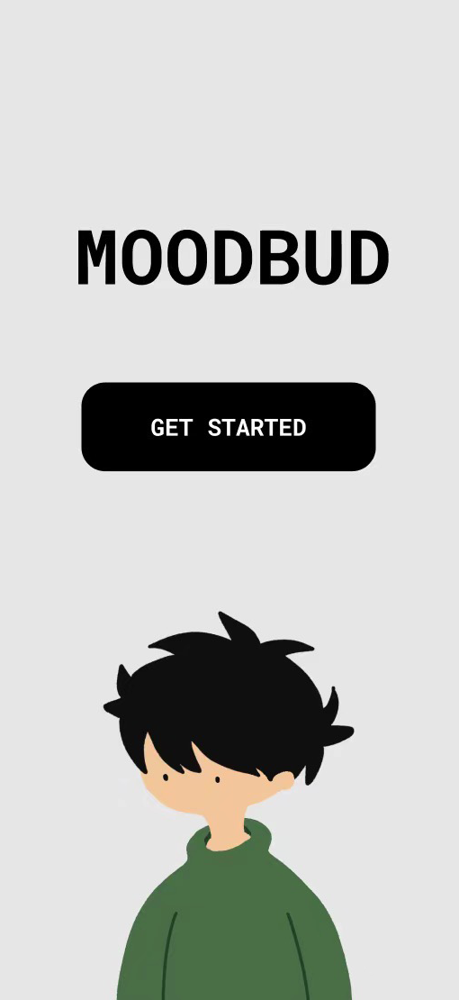
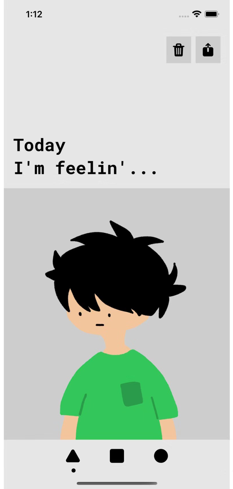
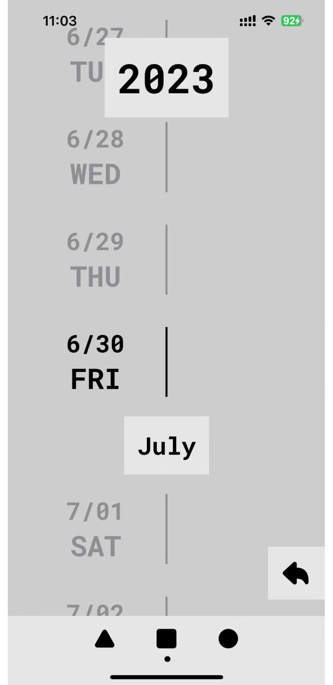
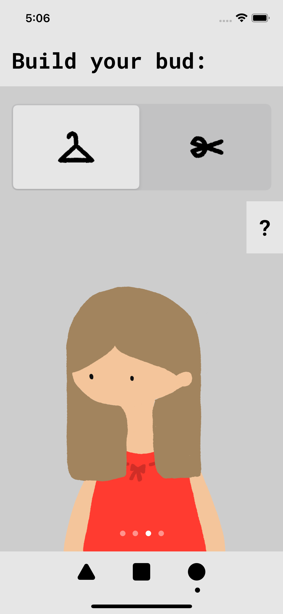
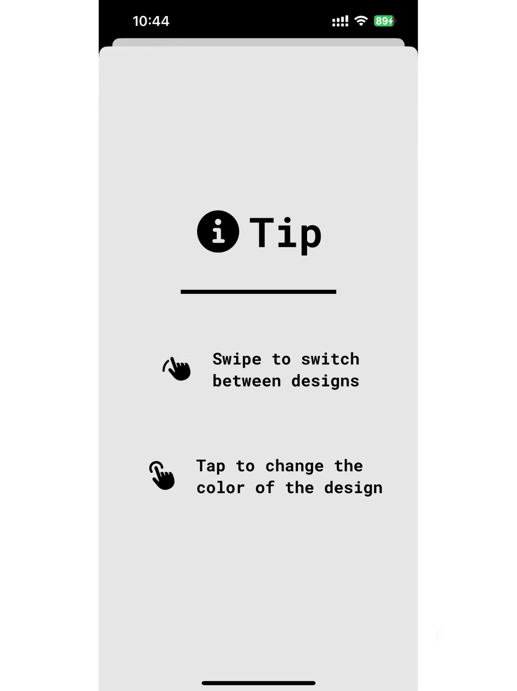
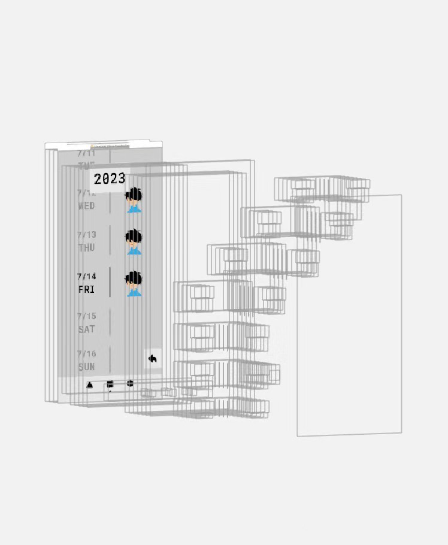

# Moodbud

This is a mood tracker mobile app that allows users to create their own avatar.

## Requirements

The following is required:
* Xcode

## Usage
> :warning: The app is not available on the App Store now
1. Download the repository
2. Run the project in Xcode

## How it works
#### Dashboard
This view allows users to select today's mood and add a note if they wish. If a mood is already chosen for today, it will display the mood along with the note. Here is also where users can choose to delete or share the current mood.
#### Calendar
This view allows users to see in calendar view the history of their moods. A back button brings the user back to the current day.
#### Avatar
This view allows users to change the appearance of their avatar. For each part (hairstyle or clothes), users can swipe to change style and tap to change color.

## Previews

  
  
  
  
  
  

## To-do List
- [ ] Minor bugs
- [ ] Dark Mode
- [ ] Support more languages
- [ ] Support image entries
- [ ] More appearance options

## Key Learnings
* SwiftUI
* Core Data
* UI Design

## Acknowledgements
* [iOSAcademy](https://www.youtube.com/@iOSAcademy)
* [SwiftUI Documentation](https://developer.apple.com/documentation/swiftui/)

For further inquiries, please contact jasminelu23@gmail.com
